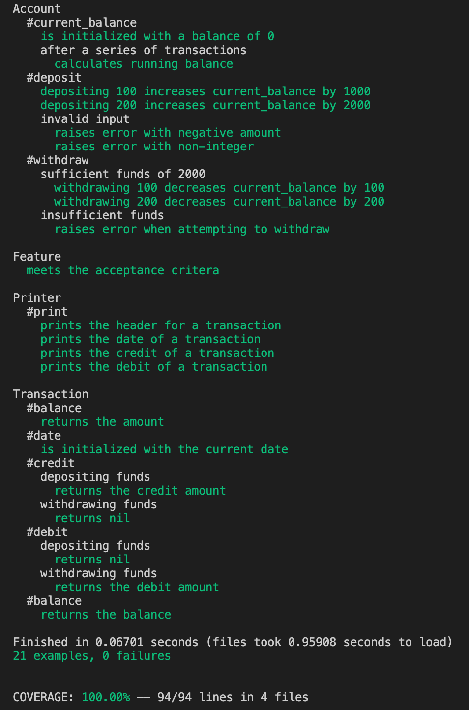
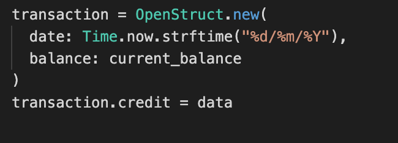

# Bank Tech Test

[](https://codeclimate.com/github/jasonrowsell/bank-tech-test/maintainability) [](https://travis-ci.com/jasonrowsell/bank-tech-test) [](https://codecov.io/gh/jasonrowsell/bank-tech-test) [](https://bettercodehub.com/) [](https://github.com/rubocop-hq/rubocop)

[Getting Started](#getting-started) | [Specification](#specification) | [Design](#design) | [Planning](#planning) | [Test Coverage](#test-coverage) | [Evaluation](#evaluation)

A sample tech test to practice writing high-quality code, demonstrate TDD and apply OOP/D.

## Getting Started

### Development

Clone this repo.
To install dependencies:

```shell
bundle
```

Run test suites with:

```shell
rspec
```

For an interactive prompt that will allow you to experiment:

Run IRB:

```shell
irb
```

Once in IRB:

```irb
require './lib/account.rb'
account = Account.new
```

### Usage

A demonstration of how to use the program.

```sh
> irb -r './lib/account.rb'

> account = Account.new

> account.deposit(1000)

> account.print_statement
date || credit || debit || balance
02/06/2021 || £1000.00 || || £1000.00

> account.deposit(2000)

> account.print_statement
date || credit || debit || balance
04/06/2021 || £2000.00 || || £3000.00
02/06/2021 || £100.00 || || £100.00

> account.withdraw(500)

> account.print_statement
date || credit || debit || balance
06/06/2021 || || £500.00 || £2500.00
04/06/2021 || £2000.00 || || £3000.00
02/06/2021 || £100.00 || || £100.00
```

## Specification

### Requirements

- You should be able to interact with your code via a REPL like IRB or the JavaScript console. (You don't need to implement a command line interface that takes input from STDIN.)
- Deposits, withdrawal.
- Account statement (date, amount, balance) printing.
- Data can be kept in memory (it doesn't need to be stored to a database or anything).

### Acceptance criteria

**Given** a client makes a deposit of 1000 on 10-01-2012  
**And** a deposit of 2000 on 13-01-2012  
**And** a withdrawal of 500 on 14-01-2012  
**When** she prints her bank statement  
**Then** she would see

```
date  || credit || debit || balance
14/01/2012 || || 500.00 || 2500.00
13/01/2012 || 2000.00 || || 3000.00
10/01/2012 || 1000.00 || || 1000.00
```

| date       | credit  | debit  | balance |
| ---------- | ------- | ------ | ------- |
| 14/01/2012 |         | 500.00 | 2500.00 |
| 13/01/2012 | 2000.00 |        | 3000.00 |
| 10/01/2012 | 1000.00 |        | 1000.00 |

## Design

### Classes

<strong>Account</strong>

- The `Account` class maintains the operational data of previous transactions, as well as
  calculating the current account balance. A transaction is made by calling `withdraw` or `deposit`, which instantiates an instance of the `Transaction` class. The method `current_balance` is called to calculate and store the updated balance in the current transaction. The private method `store_transaction` is exposed for adding the transaction
  to a sequential list of previously recorded transactions. Printing a statement is
  called with the method `print_statement` which prints a table using `print`
  that is derived from the `Printer` class. A user would instantiate an `Account`
  object, use `deposit(amount)` accordingly to deposit funds, then use `print_statement` to construct a visual bank statement.

<strong>Transaction</strong>

- The `Transaction` class holds the data from a specific transaction. It knows the account
  balance at the instance of the transaction, date it was processed, amount, and whether it
  was a deposit or withdrawal. The `date` attribute is created upon class initialization, in
  dd/mm/yy format, whilst the `balance` attribute is appended after being stored. The `credit`
  and `debit` attributes will remain `nil` dependent upon whether the `withdraw` or `deposit`
  method is called in `Account`.

<strong>Printer</strong>

- The `Printer` class formats inputted data into a string output. The `print` method iterates through each transaction record and exposes the `create_row` private method in order to format each transaction into a table row. `create_row` utilises `to_pounds`, derived from the `Conversion` module, to convert integers to a '£0.00' format.

### Modules

Modules were used for raising errors, `Exceptions`, and converting integers to currency, `Conversions`.

Modules deemed justifiable as they are collections of methods and constants. They cannot generate instances. Classes may generate instances (objects), and have per-instance state (instance variables).

<strong>Exceptions</strong>

- This module holds methods to catch edge cases. Errors are raised dependent upon invalid
  input or insufficient funds.

<strong>Conversion</strong>

- This module holds methods relating to currency formatting / manipulation. This module was
  created instead of a private method is `Printer` for flexibility. The module is flexible
  to add extra related functions if proposed, such as converting to foreign currency or
  adding interest.

### Testing

- [Test Coverage: 100%](#test-coverage), SimpleCov
- Testing covers and passes acceptance criteria
- Prominence on BDD (Behaviour Driven Development)
- Automated feature testing
- Unit tests in isolation
- Red Green Refactor loop

### Object Oriented Principle / Design

- Focus on Single Responsibility Principle

- Dependency Injection and Dependency Inversion Principle


In this case of dependency injection, `Account` should refrain from a hard dependency on `Transaction` and `Printer`, and can function without them. Furthermore, if we wish to replace dependent classes with a third, we need to modify `Account`, which is a violation of the Open Closed Principle.

This implementation of dependency injection adheres to the SOLID principles of OOD. In this case mostly the Dependency Inversion Principle.

- Encapsulation

Private methods are utilised to maintain SRP and expose only what is required.

## Test Coverage



## Evaluation

<strong>Struct / OpenStruct</strong>


I would consider converting my `Transaction` class to a Struct/OpenStruct. A `Sruct` is a dummy data container. Unlike an object, it’s used for bundling and serving a set of informations without any logic.
It provides a pair of getter/setter methods for each attribute that it contains. This is similar to the attr_accessor method for classes. `OpenStruct` acts very similarly to `Struct`, except that it doesn't have a defined list of attributes. It can accept a hash of attributes when instantiated, and you can add new attributes to the object dynamically. It isn't as fast as `Struct`, but it is more flexible.

## Planning

### User Stories

```
As a client,
So that I can keep funds secure,
I would like to make a deposit.
```

```
As a client,
So that I can access my funds,
I would like to make a withdrawal.
```

```
As a client,
So that I can keep a record of my finances,
I would like to request a bank statement.
```

```
As a client,
So that I can reference my prior transactions,
I would like my statement to display the date, transaction amount, type, and new balance.
```

```
As a Bank Manager,
In order to maintain a structured business model,
I want withdrawals accessible only if sufficient funds are present.
```

### CRC Cards

| Class                     | Account          |
| ------------------------- | ---------------- |
| Responsibilties           | Collaborators    |
| ------------------------- | ---------------- |
| Knows transaction records | Transaction      |
| Deposit amount            | Printer          |
| Withdraw amount           |                  |
| Print bank statement      |                  |

| Class                     | Transaction      |
| ------------------------- | ---------------- |
| Responsibilties           | Collaborators    |
| ------------------------- | ---------------- |
| Knows date                |                  |
| Knows credit amount       |                  |
| Knows debit amount        |                  |
| Knows balance             |                  |

| Class                       | Printer          |
| --------------------------- | ---------------- |
| Responsibilties             | Collaborators    |
| -------------------------   | ---------------- |
| Render a string output      |                  |
| Format integers to currency |                  |

### Sequence Diagrams

<strong>Depositing Funds</strong>


<strong>Printing Statement</strong>

